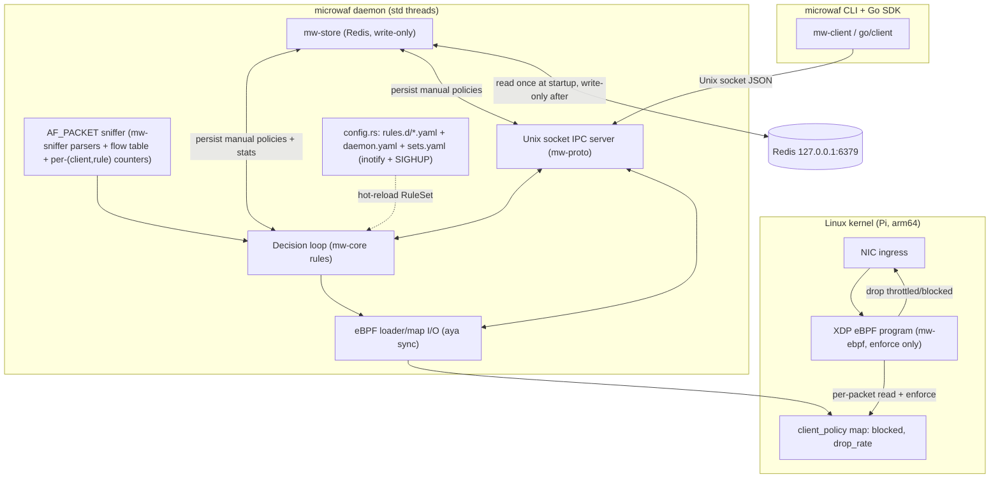
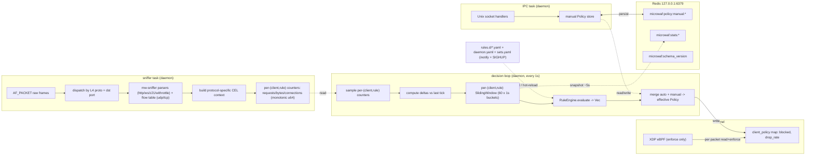

# MicroWAF — Architecture

MicroWAF is a lightweight, transparent Web Application Firewall (WAF) that runs
directly on a Linux host (Raspberry Pi, `arm64`) to protect local web and
WebSocket services. It inspects traffic at the application layer (L7), counting
HTTP request intensity and WebSocket frames per unique client (`mac`, `ip`) on
the LAN. When a client exceeds a configured limit (RPS/RPM/BPS/BPM), MicroWAF
automatically applies throttling to that client's subsequent packets. The
decision loop is written in Rust and cooperates with high-performance Linux
kernel mechanisms (eBPF), so abuse is curbed with negligible overhead and **no
modification to the protected applications' code**.

This document is the canonical architecture reference; `docs/*.md` elaborate on
individual subsystems (socket API, CLI, rules, Go SDK).

---

## 1. Assumptions (założenia)

1. **Host topology.** The Raspberry Pi is the **host** running the protected web
   and WebSocket applications (not a gateway/router). XDP on the ingress NIC
   sees the real client MAC (same L2 segment) or the router MAC with the
   **original client IP** preserved (client behind a router). The client key is
   therefore the pair `ClientId { mac: [u8;6], ip: IpAddr }`, not MAC alone, so
   per-client attribution works in both cases.

2. **Plaintext L7 only.** HTTP request lines, WebSocket frames, Z21 records
   (UDP), and WiThrottle lines (TCP) are parsed in userspace from `AF_PACKET`
   frames. **TLS (HTTPS/WSS) is opaque**: encrypted traffic can only be matched
   by generic `tcp` rules (bytes/connections), never by parsed-protocol rules.
   Z21 is UDP (no TLS); WiThrottle is plaintext TCP by default — both are fully
   parseable.

3. **eBPF framework: aya (pure Rust).** The eBPF program is written in Rust and
   compiled to `bpfel-unknown-none`; the daemon loads it via aya's sync API.

4. **Sniffer-only counting.** The kernel (XDP) only enforces policy (reads
   `client_policy`, drops); all counting (requests/bytes/connections) is in
   userspace (AF_PACKET sniffer), per (client, rule). The kernel hot path is
   deliberately dumb; all rule semantics live in one testable crate (`mw-core`).

5. **Throttling = drop-induced TCP backoff.** "Dynamic delay" is realized by
   dropping a configurable fraction of a client's packets in XDP, which makes
   TCP back off and slow its sending rate. True `netem` per-client delay is a
   future enhancement.

6. **Redis is write-only at runtime.** Redis persists manual policies and client
   statistics so a daemon restart does not lose data. The daemon reads Redis
   **exactly once at startup** to restore in-memory state; after that it only
   writes. External mutations to `microwaf:*` keys are never observed and are
   overwritten on the daemon's next write. Redis is a durable write-ahead log
   for restart recovery, not a shared store.

7. **Rules are declarative YAML + CEL, hot-reloadable.** Rules live in
   `<config-dir>/rules.d/*.yaml` (drop-in directory) and are hot-reloaded via
   inotify (`notify` crate) and `SIGHUP`. They are read-only via IPC — the CLI
   can list rules but not add/remove them; rule authority stays in the files.
   Scoping conditions are written in CEL (`match` field).

8. **Foreground daemon, std threads.** Like the org's `wireless-programmer`, the
   daemon is a foreground long-running process using `std::thread` +
   `parking_lot::Mutex` (no `tokio` in the daemon).

9. **Bounded memory.** BPF maps cap clients at `MAX_CLIENTS = 8192`; per-client
   sliding window is 60 × 1s buckets.

10. **arm64 + amd64 builds.** CI produces static musl binaries for both targets;
    the Pi runs the `arm64` build.

11. **Two run modes: enforce / permissive.** In `enforce` (default) the daemon
    writes the BPF policy map and XDP drops/throttles for real. In `permissive`
    it evaluates rules and records would-be actions but never writes the policy
    map (XDP only counts). Mode is set at startup (`daemon.yaml: mode` /
    `--mode`), not hot-reloadable. See "Run modes".

---

## 2. High-level architecture



---

## 3. Workspace layout

```
microwaf/
├── Cargo.toml                 # workspace, resolver "2", edition 2021, MIT
├── rust-toolchain.toml        # nightly (aya eBPF needs nightly)
├── .cargo/config.toml
├── Makefile
├── LICENSE                    # MIT
├── README.md
├── ARCHITECTURE.md            # this file
├── .github/workflows/{ci,release}.yml
├── docs/{api,cli,rules,go-client}.md
├── go/                        # Go SDK (mirrors wireless-programmer/go)
│   ├── go.mod                 # module github.com/dcc-bigfred/microwaf/go
│   └── client/                # client.go, doc.go, frame_test.go
└── crates/
    ├── mw-proto/              # wire types + framing (length-prefixed JSON)
    ├── mw-core/               # ClientId, counters, rules engine, policy, traits
    ├── mw-ebpf/               # eBPF program (no_std, target bpfel-unknown-none) — aya
    ├── mw-sniffer/            # pure L7 parsing (HTTP request, WS frame) + CEL match helper — no I/O
    ├── mw-store/              # Redis-backed persistence for manual policies + stats
    ├── mw-client/             # sync Unix socket client SDK (no tokio/clap)
    └── microwaf/              # binary: daemon (IPC + sniffer + eBPF loader + decision loop) + CLI
```

---

## 4. Crate responsibilities

| Crate | Role | I/O? |
|---|---|---|
| **mw-proto** | `Request`/`Response` enums (`camelCase`, `type` discriminator), `ErrorBody`, `read_frame`/`write_frame` (4-byte LE `u32` + UTF-8 JSON), `MAX_FRAME_BYTES = 1 MiB`. | codec only |
| **mw-core** | Pure rule logic: `ClientId`, `Protocol`, `Metric { Requests, Bytes, Connections }`, `Rule` (protocol+ports+match), `SlidingWindow`, `RuleEngine`, `Policy`/`ManualPolicy`/`AutoPolicy`/`ClientPolicy` + merge, `Enforcer` trait + `Mode { Enforce, Permissive }`, `ManualPolicyStore`/`ClientStatsStore` traits, `ConfigRule`/`DaemonConfig`/`SetsConfig` YAML serde (`serde_yaml`), CEL context types per protocol, errors (`thiserror`). Depends on `cel` (compile + eval). | none — host-testable |
| **mw-ebpf** | aya eBPF (`#![no_std]`, `#![no_main]`): XDP program enforces policy only (reads `client_policy`, drops). Does **not** count or evaluate rules. | kernel |
| **mw-sniffer** | Pure L7 detectors: `detect_http_request` (returns `{ method, path, upgrade_ws }`, recognizes `Upgrade: websocket`), `detect_ws_frame` (returns `{ fin, opcode, payload_len }`; first-packet inspection), `detect_z21_records` (UDP; splits `DataLen|Header|Data` records per packet, little-endian), `detect_withrottle_lines` (TCP; splits on CR/LF, parses 2-3 char prefix + MultiThrottle id, strips `AT+CIPSENDBUF=` LNWI noise), plus a `cel_match(program, ctx)` helper. No sockets. | none — host-testable |
| **mw-store** | Redis-backed `ManualPolicyStore` + `ClientStatsStore` (sync `redis` crate). Read-once-at-startup, write-only-at-runtime. Schema version check + discard-on-mismatch. | Redis |
| **mw-client** | Sync Unix socket client SDK (`std::os::unix::net::UnixStream`), timeouts, `ClientError`. | Unix socket |
| **microwaf** | Binary: daemon (IPC + AF_PACKET sniffer with multi-protocol dispatch + flow table + per-(client,rule) counters + aya eBPF loader + `BpfEnforcer` + decision loop with `PermissiveEnforcer` + config hot-reload + run-mode) and CLI. The XDP object is **embedded** at build time (`build.rs` / `include_bytes!`) and loaded via `Ebpf::load`; optional `MICROWAF_BPF_OBJECT` / `MICROWAF_BPF_EXTRACT`. | all |

**Dependency direction:** `mw-proto` ← `mw-core` (← `cel`) ← {`mw-store`, `mw-sniffer` (← `cel`), `mw-client`, `mw-ebpf` loader side} ← `microwaf`. `mw-core` depends on nothing but `mw-proto`, `cel`, and std/serde/thiserror, so the rule engine is fully unit-testable without Redis, sockets, or eBPF.

---

## 5. Data flow — counting, rules, enforcement



**Step by step:**

1. **XDP (kernel, per packet):** parse Ethernet → IP → `(src_mac, src_ip)`. Look up
   `client_policy[client]`: if `blocked && !expired` → `XDP_DROP`; else if
   `drop_rate > 0` and `get_random() % 100 < drop_rate` → `XDP_DROP`; else
   `XDP_PASS`. XDP no longer counts — all counting is in the sniffer.
2. **Sniffer task (userspace):** `AF_PACKET` raw frames → dispatch by
   (L4 protocol, dst port) to the right `mw-sniffer` parser. For each packet,
   find all rules whose `protocol`+`ports` match; parse the protocol-specific
   units (HTTP request lines, WS frames, Z21 records, WiThrottle lines) or
   track flows (Udp/Tcp); for each matching rule, evaluate the CEL `match` (if
   any) against the unit's context and increment that rule's per-(client, rule)
   counter (requests/bytes/connections). WS handshakes mark the TCP 4-tuple as a
   WS connection so subsequent frames count as `WebSocket` requests.
3. **Decision loop (every 1s):** sample per-(client, rule) counters, compute
   deltas vs last tick, push into per-(client, rule) `SlidingWindow`s, evaluate
   each rule against its own window, merge auto + manual policy, write effective
   policy to the BPF `client_policy` map. Periodically (~`statsSnapshotSecs`)
   snapshot stats to Redis.
4. **IPC task:** handles CLI requests over the Unix socket; manual
   `throttle`/`block`/`unthrottle`/`unblock` mutate the in-memory manual-policy
   map and persist to Redis; `top`/`clients`/`rules`/`info` are read-only
   queries against in-memory state.

---

## 6. Rules engine

### Rule model

```rust
pub enum Protocol {
    Http,        // TCP — parse HTTP requests (L7)
    WebSocket,   // TCP — parse WS frames after handshake (L7)
    Z21,         // UDP — parse Z21 records (L7), ports 21105/21106
    Withrottle,   // TCP — parse WiThrottle lines (L7), port 12090
    Udp,         // generic UDP — no L7 parse; count flows + bytes
    Tcp,          // generic TCP — no L7 parse; count flows + bytes
}
pub enum Metric { Requests, Bytes, Connections }   // see "Counter semantics" below
pub enum Window { PerSecond, PerMinute }
pub enum Action {
    Throttle { drop_rate: u8 },        // drop X% of client packets (0..=100)
    Block,                             // drop 100% of client packets
}

pub struct Rule {
    pub id: RuleId,
    pub protocol: Protocol,
    pub ports: Option<Vec<u16>>,       // input ports of the protected service; mandatory for parsed protocols, optional for Udp/Tcp (None = all ports)
    pub metric: Metric,
    pub window: Window,
    pub limit: u64,                    // max allowed sum within window
    pub action: Action,
    pub min_threshold: u64,            // hot-band floor for `top` (`hot: true`)
    pub r#match: Option<cel::Program>, // optional CEL filter on the protocol-specific context (see "CEL context")
}
```

**Metric validity by protocol:**
- Parsed protocols (`Http`, `WebSocket`, `Z21`, `Withrottle`): `metric ∈ { Requests, Bytes }`.
- Generic protocols (`Udp`, `Tcp`): `metric ∈ { Connections, Bytes }` (no L7 → no "requests").

**Ports:** mandatory when `protocol` is a parsed protocol (the rule must name the
service's input ports, e.g. Z21 → `[21105, 21106]`, WiThrottle → `[12090]`,
HTTP → `[80, 443]`); a parsed rule without `ports` is a validation error. For
`Udp`/`Tcp`, `ports` is optional (None = count all UDP/TCP traffic for the client;
Some = only the listed ports).

**Overlapping rules.** Rules may overlap — multiple rules can select the same
protocol+ports (e.g. one counting Z21 `Requests` per second, another counting Z21
`Bytes` per minute on port 21105). **Each rule is counted independently** — the
sniffer evaluates every rule whose selector matches a packet and increments that
rule's per-(client, rule) counter. There is no "aggregate vs scoped" distinction;
every rule has its own counter per client, bounded by `MAX_RULES` (default 256;
a config with more rules is rejected at load).

`min_threshold` marks the hot band in `top` (`hot: true`); it no longer hides quieter clients.

**Match (CEL, optional, protocol-specific).** A rule with `match = Some(prog)`
counts only the matching units (requests/records/lines/flows) for which the CEL
expression evaluates to `true`; `match = None` counts all units selected by the
protocol+ports selector. The CEL program is compiled **once at rule load** (a
compile error rejects the reload, old `RuleSet` stays); evaluated per matching
unit in the sniffer (sandboxed, non-Turing, bounded cost).

**CEL context** (bindings vary by protocol):
- Common to all: `client.mac` (string `aa:bb:cc:dd:ee:ff`), `client.ip` (string),
  `time.epoch` (int), `time.hour` (int 0–23), `time.dow` (int 0–6),
  `sets` (map<string, list<string>>, named sets from `sets.yaml`), `port` (int,
  the matched dst port).
- `Http`: `request.method`, `request.path` (normalized), `request.headers` (map),
  `request.query` (map).
- `WebSocket`: `frame.fin` (bool), `frame.opcode` (int), `frame.payloadLen` (int).
- `Z21`: `z21.header` (int, the 16-bit Z21 header), `z21.xheader` (int, the X-BUS
  sub-header when `header == 0x40`, else 0), `z21.dataLen` (int), `z21.data` (bytes).
  E.g. `z21.header == 0x40 && z21.xheader == 0xE4` (drive command).
- `Withrottle`: `withrottle.prefix` (string, e.g. `"M0A"`, `"PTA"`, `"PPA"`, `"*"`),
  `withrottle.command` (string, the full line minus the newline),
  `withrottle.throttle` (string, the MultiThrottle id char, or `""` for non-`M` lines).
- `Udp`/`Tcp`: no protocol-specific bindings (only the common ones); `match`
  typically filters on `client`/`time`/`sets`/`port`.

Convenience helpers in the CEL environment: `request.path.matches(glob)`,
`request.path.startsWith(p)`, `client.ip in sets["blocked"]`, CIDR matching for
`client.ip in sets[...]`.

### Counter semantics

All counting is **per (client, rule)** — every rule has its own independent
counter per client (rules may overlap and each is counted separately). The
sniffer (AF_PACKET) does all counting; XDP only enforces.

- `requests` (per client, rule) — for parsed protocols: counts the parsed units.
  `Http` = HTTP request lines; `WebSocket` = WS frames (after handshake; the
  handshake itself is a connection event, not a request); `Z21` = Z21 records
  (one per `DataLen|Header|Data` in a UDP packet — a single UDP packet may carry
  several records, each counted); `Withrottle` = WiThrottle command lines (one
  per newline-terminated line). Incremented only when the rule's selector
  (protocol+ports) matches and the CEL `match` (if any) is true.
- `bytes` (per client, rule) — sum of payload bytes of packets matching the
  rule's selector (protocol+ports) and CEL `match` (if any). Valid for all
  protocols.
- `connections` (per client, rule) — for `Udp`/`Tcp` only: counts new flows.
  `Tcp` = a new flow starts on a SYN packet initiating an unseen 4-tuple
  `(src_ip, src_port, dst_ip, dst_port)`; `Udp` = a new flow starts on the first
  packet of an unseen 4-tuple, with an idle timeout (default 60s) so a resumed
  flow counts as a new connection. Flows are tracked in a bounded `FlowTable`
  (`MAX_FLOWS`, default 8192, LRU).
- `ws_connections` (per client, diagnostic) — WebSocket handshakes
  (`Upgrade: websocket`), per client. Diagnostic counter (shown in
  `clients`/`top`); not a rule metric. The WS handshake marks the TCP 4-tuple as
  a WS connection so subsequent frames on it are counted as `WebSocket`
  `requests`.

**Hot path:** for each packet, the sniffer determines the L4 protocol + dst port,
finds all rules whose `protocol`+`ports` match, parses the protocol-specific
units (if a parsed protocol), and for each rule evaluates the CEL `match` (if
any) against the unit's context; each match increments that rule's counter
(requests/bytes/connections as appropriate). Bounded by `MAX_RULES` (default 256).

### Counters — single source (AF_PACKET sniffer), monotonic

| Counter | Source | Updated by | Stored in |
|---|---|---|---|
| `requests`, `bytes`, `connections` (per client, rule) (L7 + L4) | AF_PACKET sniffer | sniffer task, per packet / per parsed unit / per new flow | userspace `CounterStore` |
| `ws_connections` (per client, diagnostic) | AF_PACKET sniffer | sniffer task, per WS handshake | userspace `CounterStore` |

All are **monotonic cumulative** (never reset). The decision loop computes
*deltas* between ticks, so a crash/restart does not corrupt accounting. The
daemon's cumulative counters + sliding-window snapshots are persisted to Redis
(~`statsSnapshotSecs`) so a restart does not lose stats; the sniffer store +
flow table reset on restart, but the daemon re-baselines from the persisted
cumulative values. XDP no longer counts (it only enforces); the `client_stats`
BPF map is dropped — enforcement reads only `client_policy`.

### Sliding window (per client, per rule)

The decision loop keeps one `SlidingWindow` **per (client, rule)** that the
client has hit (lazily created), bounded to `MAX_RULES` entries per client.

```rust
pub struct SlidingWindow {
    buckets: [Bucket; 60],   // 60 x 1s => up to 60s window
    cursor: usize,
    last_advance: Instant,
}
pub struct Bucket { requests: u64, bytes: u64, connections: u64 }
```

Each tick: advance cursors, zero new buckets, add deltas from the sniffer
counters. Each (client, rule) window stores the metric the rule cares about
(`requests`/`bytes`/`connections`); the window only tracks that one metric to
save memory. `sum(1)` = per-second, `sum(60)` = per-minute. Memory bounded:
`MAX_CLIENTS × MAX_RULES × 60 × 8 bytes`.

### Evaluation

```rust
impl RuleEngine {
    pub fn evaluate(&self, per_rule: &RuleWindows, now: Instant) -> Vec<Violation> {
        self.rules.iter().filter_map(|r| {
            let secs = match r.window { PerSecond => 1, PerMinute => 60 };
            let value = per_rule.sum(r.id, r.metric, secs);   // this rule's windowed metric value (0 if client never hit it)
            (value > r.limit).then(|| Violation { rule_id: r.id, value, limit: r.limit, action: r.action })
        }).collect()
    }
}
```

`per_rule.sum(rule_id, metric, secs)` sums the given metric over the last `secs`
buckets of that `(client, rule_id)` window (lazily created when first
incremented; absent → 0).

### Policy — two sources merged

```rust
pub struct ManualPolicy { throttle: Option<u8>, blocked: bool, until: Option<Instant> } // from CLI
pub struct AutoPolicy   { drop_rate: u8, blocked: bool, rule_id: RuleId, until: Instant } // from rule engine (cooldown)
pub struct ClientPolicy { manual: Option<ManualPolicy>, auto: Option<AutoPolicy> }
```

Effective policy written to the BPF map each tick:
- `blocked = manual.blocked || auto.blocked`
- `drop_rate = max(manual.throttle, auto.drop_rate)` (0 if neither)
- `expires_at = earliest of manual.until / auto.until` (for eBPF expiry check)

A manual CLI throttle coexists with automatic rule throttling: removing the
manual one does not lift an active rule-driven throttle, and a rule clearing
does not lift a manual block.

### Cooldown / hysteresis (auto policy)

When a rule fires, the loop sets `AutoPolicy { until: now + COOLDOWN }` (default
30s, configurable). While in cooldown the throttle stays even if the windowed
value drops below `limit` (prevents flapping). After cooldown, re-evaluate:
still violating → extend; clear → drop `auto`. Manual policies expire
independently by their `until` (or never, if `None` = permanent).

### Enforcement (eBPF, per packet)

XDP reads `client_policy[client]`: blocked → `XDP_DROP`; else if `drop_rate > 0`
and `random() % 100 < drop_rate` → `XDP_DROP`; else pass and increment stats.

### Run modes (enforce / permissive)

The daemon runs in one of two modes, chosen at **startup** (not hot-reloadable —
a mode change requires a restart, since it swaps the enforcement backend):

- **`enforce`** (default) — the decision loop writes the effective policy to the
  BPF `client_policy` map; XDP drops/throttles for real.
- **`permissive`** — the decision loop still evaluates rules, merges policy, and
  computes the effective policy per client, but **does not write** the BPF
  `client_policy` map (it stays empty → XDP passes all and only counts L4).
  Instead it records **would-be actions** so `top`/`clients` can show what *would*
  have happened.

Mode is set via `daemon.yaml: mode: enforce|permissive` (default `enforce`) and
overridden by the `--mode` CLI flag / `MICROWAF_MODE` env. `info` reports the
active mode; `clients`/`top` responses carry a `wouldBeAction` field in
permissive mode (the action that would have been applied; null in enforce mode,
where the real `action` is reported instead).

The enforcement backend is abstracted behind an `Enforcer` trait in `mw-core`
(host-testable, no I/O), so the decision loop depends on the trait and is
unit-tested with a fake enforcer:

```rust
pub trait Enforcer: Send + Sync {
    fn apply(&self, client: ClientId, policy: ClientPolicy);
    fn clear(&self, client: ClientId);
}
```

Two implementations live in the `microwaf` binary:
- `BpfEnforcer` (`ebpf.rs`) — writes the BPF `client_policy` map (real
  enforcement). Used in `enforce` mode.
- `PermissiveEnforcer` (`decision.rs`) — no BPF write; records
  `WouldBeAction { client, action, at }` in a bounded `PermissiveLog` (LRU, last
  N per client) shared with IPC so `clients`/`top` annotate would-be actions.
  Used in `permissive` mode.

XDP is loaded in **both** modes (L4 counting always runs); only the policy-map
write is gated by the mode.

### `top` semantics

`top --limit N [--rule-id ID] [--protocol P] [--metric M]` returns known clients
ranked for an htop-style view:

1. **Hot band first** — clients with any matching rule at/above that rule's
   `min_threshold`, sorted by highest windowed value descending.
2. **Everyone else below** — remaining known clients (windows, manual policies,
   counters), also by score descending.

`violations` lists windowed values for every matching rule (including zeros),
aligned with `columns` (`ruleId`, `window`, `limit`, `minThreshold`). CLI renders
each rule as a column with rates `N/s` (`per-second`) or `N/m` (`per-minute`).
Each row carries `hot: true` when it belongs to the hot band. `limit` 0 means
unlimited; otherwise truncate after ranking. Filters: `--rule-id`, `--protocol`,
`--metric`. Computed from in-memory `SlidingWindow`s — no BPF map access on the
query path.

---

## 7. Persistent storage (Redis — write-only at runtime)

Default `redis://127.0.0.1:6379/0`, configurable via `--redis-url` /
`MICROWAF_REDIS_URL`. Goal: a daemon restart must not lose manual throttle/block
decisions or client statistics.

**Redis is used in write-only mode at runtime.** The daemon reads from Redis
**exactly once at startup** to restore in-memory state; after that it only
writes. External mutations to `microwaf:*` keys are never observed and have no
effect — the in-memory state is the sole authority while the daemon runs.

| What | Redis key | Startup read | Runtime write |
|---|---|---|---|
| Manual policies | `microwaf:policy:manual:<clientId>` (JSON) | yes | yes, on every IPC mutation |
| Client statistics | `microwaf:stats:<clientId>` (JSON) | yes | yes, periodic snapshot (~`statsSnapshotSecs`) |
| Schema version | `microwaf:schema_version` (string) | yes | yes, on first run / after a discard |

**Rules are NOT in Redis** — they live in `rules.d/*.yaml`, hot-reloadable.

### Schema versioning / incompatibility

On startup the daemon reads `microwaf:schema_version`:
- **missing** → first run: write current `SCHEMA_VERSION`, proceed empty.
- **matches** → load manual policies + client stats into memory.
- **mismatch** → **discard all `microwaf:*` keys** (`SCAN` + `DEL` by prefix),
  write current `SCHEMA_VERSION`, start fresh, log a warning. A daemon upgrade
  never interprets stale-shaped data incorrectly.

Bump `SCHEMA_VERSION` whenever the JSON shape of `policy:manual` or `stats`
changes.

### Restart semantics (read once at startup)

- **Manual policies**: reloaded into the in-memory map and re-applied to the BPF
  `client_policy` map on the first tick. A temporary policy whose TTL already
  expired is dropped on load. After load, the daemon never re-reads these keys.
- **Client stats**: cumulative counters + sliding windows reloaded into memory.
  The eBPF map and sniffer store start at 0 after restart, so the loop
  re-baselines: records eBPF/sniffer values at startup as the baseline and adds
  future deltas to the persisted cumulative values. Stale window buckets older
  than 60s are dropped on load (a long downtime does not produce a fake burst).
- **Auto (rule-driven) policy**: not persisted — recomputed from the reloaded
  sliding windows on the first tick.

### Runtime = write-only

- Decision loop and IPC handlers read **only** in-memory state — never Redis.
- Manual-policy IPC mutations write to Redis best-effort (a write failure is
  logged but does not reject the request — the in-memory change already took
  effect).
- Client-stats writes are periodic snapshots; losing the last few seconds on a
  crash is acceptable.
- External edits to `microwaf:*` keys are invisible to the daemon and will be
  overwritten on its next write.

---

## 8. Configuration (YAML drop-in directory)

Config lives under a config dir (`--config-dir` / `MICROWAF_CONFIG_DIR`, default
`$BIGFRED_DATA_DIR/etc/microwaf`, fallback `$DATA_DIR/etc/microwaf` then
`/etc/microwaf`):

```
<config-dir>/
├── daemon.yaml          # daemon-level settings
├── sets.yaml            # named sets referenced by CEL `match`
└── rules.d/             # rules as YAML drop-in files, hot-reloadable
    ├── 00-baseline.yaml
    ├── 10-bytes.yaml
    └── …
```

- Each `rules.d/*.yaml` is a YAML list of rule objects (single object also
  accepted), `camelCase` fields (`dropRate`, `minThreshold`). All files merge
  into one `RuleSet`, sorted by filename. Rule IDs must be unique across all
  files — a duplicate, invalid file, or CEL compile error rejects the whole
  reload (old `RuleSet` stays, error logged). More than `MAX_RULES` (default
  256) rules are rejected.
- `daemon.yaml` holds `interface`, `cooldownSecs`, `statsSnapshotSecs`,
  `allowUsers`. CLI flags override it and require restart for
  `interface`/`--redis-url`/`--socket`; `cooldownSecs`/`statsSnapshotSecs`/
  `allowUsers` are hot-reloadable.
- `sets.yaml` defines named sets (CIDRs / IPs / strings) referenced in CEL as
  `client.ip in sets.allowlist`. Hot-reloaded with the rules.

### Hot-reload

The daemon watches `<config-dir>` recursively with the `notify` crate (inotify
on Linux) and reloads on any create/modify/delete/move of a `.yaml` file.
`SIGHUP` is a manual reload trigger too. On reload: re-read `daemon.yaml` +
`sets.yaml` + all `rules.d/*.yaml`, compile each rule's CEL `match`,
validate (protocol/metric/ports, `MAX_RULES`), and **atomically swap** the live `RuleSet` via
`arc_swap::ArcSwap<RuleSet>` (decision loop reads it lock-free). On validation
or CEL-compile error the old state stays and the error is logged. A ~200ms
debouncer coalesces editor save flurries.

Example `rules.d/00-baseline.yaml`:

```yaml
# HTTP — protect a web app on ports 80/443
- id: http-rps-100
  protocol: http
  ports: [80, 443]
  metric: requests
  window: per-second
  limit: 100
  action: { kind: throttle, dropRate: 50 }
  minThreshold: 50

- id: http-login-rps-10
  protocol: http
  ports: [80, 443]
  metric: requests
  window: per-second
  limit: 10
  action: { kind: throttle, dropRate: 80 }
  minThreshold: 5
  match: 'request.method == "POST" && request.path.matches("/api/login*")'

# WebSocket — protect a WS app on port 8080
- id: ws-frames-rps
  protocol: websocket
  ports: [8080]
  metric: requests
  window: per-second
  limit: 200
  action: { kind: throttle, dropRate: 30 }
  minThreshold: 100

# Z21 — protect the command station on UDP 21105/21106
- id: z21-rps
  protocol: z21
  ports: [21105, 21106]
  metric: requests
  window: per-second
  limit: 500
  action: { kind: throttle, dropRate: 50 }
  minThreshold: 200

- id: z21-drive-burst
  protocol: z21
  ports: [21105, 21106]
  metric: requests
  window: per-second
  limit: 50
  action: { kind: block }
  minThreshold: 20
  match: 'z21.header == 0x40 && z21.xheader == 0xE4'   # LAN_X_SET_LOCO_DRIVE only

# WiThrottle — protect the throttle server on TCP 12090
- id: wt-speed-spam
  protocol: withrottle
  ports: [12090]
  metric: requests
  window: per-second
  limit: 30
  action: { kind: block }
  minThreshold: 10
  match: 'withrottle.prefix == "M0A"'   # throttle actions (speed/dir/func) only

# Generic TCP — protect an arbitrary TCP service on port 5000
- id: tcp-conn-per-sec
  protocol: tcp
  ports: [5000]
  metric: connections
  window: per-second
  limit: 20
  action: { kind: throttle, dropRate: 60 }
  minThreshold: 10

- id: tcp-bytes-per-min
  protocol: tcp
  ports: [5000]          # overlaps with tcp-conn-per-sec; counted independently
  metric: bytes
  window: per-minute
  limit: 10485760         # 10 MiB
  action: { kind: block }
  minThreshold: 5242880

# Generic UDP — all UDP traffic for the client (no ports = all)
- id: udp-bytes-per-sec
  protocol: udp
  metric: bytes
  window: per-second
  limit: 5242880         # 5 MiB/s
  action: { kind: throttle, dropRate: 50 }
  minThreshold: 1048576
```
`protocol` selects the L7 parser (or generic udp/tcp). `ports` is **mandatory**
for parsed protocols (`http`/`websocket`/`z21`/`withrottle`) and optional for
`udp`/`tcp` (omitted = all ports). `match` is an optional CEL expression
evaluated against the protocol-specific context (see "CEL context"); omitted =
count all units selected by protocol+ports. The CEL program is compiled once
at load; a compile error rejects the reload. Rules may overlap (same
protocol+ports) and each is counted independently.

Example `sets.yaml`:

```yaml
allowlist:
  - 10.0.0.0/8
  - 192.168.1.0/24
blocked:
  - 203.0.113.0/24
```

Example `daemon.yaml`:

```yaml
mode: enforce            # enforce (default) | permissive — startup only, not hot-reloadable
interface: any
cooldownSecs: 30
statsSnapshotSecs: 5
allowUsers: [root, bigfred, bigfred-wizard]
```

---

## 9. IPC (Unix socket)

- **Transport:** Unix domain socket, default path
  `$BIGFRED_DATA_DIR/run/microwaf/microwaf.sock` (fallback `$DATA_DIR`, then
  `/data`), mode `0660`, owned by the daemon's group.
- **Framing:** 4-byte little-endian `u32` length prefix + UTF-8 JSON body;
  `MAX_FRAME_BYTES = 1 MiB`; oversized frames rejected; one request → one
  response per connection.
- **Auth:** `SO_PEERCRED` + username allowlist (`MICROWAF_ALLOW_USERS`, default
  `bigfred,bigfred-wizard`); socket chowned to the primary group of the first
  allowlist user.
- **Schema:** `Request`/`Response` with `camelCase` fields and a `type`
  discriminator. Methods: `info`, `top { limit, rule, ruleId }`, `listClients`,
  `throttle`, `unthrottle`, `block`, `unblock`, `listRules`. Errors carry `code`
  (`forbidden`, `notFound`, `invalid`, `busy`) + `message`. `info` carries `mode`
  (`enforce`/`permissive`); `listClients`/`top` carry `wouldBeAction` in
  permissive mode (the action that would have been applied; null in enforce
  mode, where the real `action` is reported). See `docs/api.md` for the full
  reference.

---

## 10. CLI

One binary is both daemon and client (clap derive). No subcommand → run daemon.

```
microwaf [daemon] [--interface IFACE] [--redis-url URL] [--socket PATH] [--config-dir DIR] [--mode enforce|permissive] [--verbose]
microwaf info
microwaf top    [-n N] [--rule-id ID] [--protocol P] [--metric M] [--interval DUR] [--once]
microwaf clients
microwaf throttle <client> [-d DURATION] [--rate R]
microwaf unthrottle <client>
microwaf block   <client> [-d DURATION]
microwaf unblock <client>
microwaf rules
```

`<client>` is `aa:bb:cc:dd:ee:ff` (MAC) or `aa:bb:cc:dd:ee:ff@1.2.3.4` (MAC+IP).
`--duration` omitted = permanent; present = temporary (expires_at). `info`
returns the daemon version from `version.rs` (ELF section `.microwaf.version`,
`MICROWAF_GIT_COMMIT`/`MICROWAF_BUILD_TIME`). See `docs/cli.md`.

---

## 11. Go SDK (`go/client`)

A Go client library mirroring the org's `wireless-programmer/go/client` (same
module path scheme, same framing, same doc style). Module
`github.com/dcc-bigfred/microwaf/go`, `go 1.22`.

- `client.go`: `Client` with `Dial`/`Close` and one method per IPC request; wire
  types mirror `mw-proto` with `// mirrors mw_proto::X` comments and `camelCase`
  JSON tags; sentinel errors `ErrForbidden`/`ErrNotFound`/`ErrInvalid`/`ErrBusy`;
  constants `DefaultSocket`, `maxFrameBytes = 1 MiB`, `defaultTimeout = 10s`.
- `doc.go`: package doc describing the protocol.
- `frame_test.go`: framing tests (short writes, exact-length read, oversized
  rejection).
- `docs/go-client.md`: usage reference.

CI runs `go vet ./...` and `go test ./...` in `go/`.

---

## 12. Security model

- The Unix socket is the only control plane; it is protected by filesystem
  permissions (`0660`), group ownership, and `SO_PEERCRED` username allowlisting.
  Only allowlisted users may issue `throttle`/`block`/`unthrottle`/`unblock`.
- The daemon must run as **root** (or `CAP_BPF` + `CAP_NET_ADMIN` + interface
  access) to load XDP and read `AF_PACKET`. The socket is still owned by the
  daemon's group so non-root allowlisted users can drive the CLI.
- Redis is bound to `127.0.0.1` and not exposed; it stores no secrets, only
  policy/stats state.
- Throttling/blocking is per-client and never affects other clients; a misconfig
  in `rules.d/` is rejected before swap, so a bad rule cannot take the daemon
  down.

---

## 13. Limitations / future

- **TLS is opaque** to L7 sniffing — encrypted HTTP/WS/WiThrottle traffic can
  only be matched by generic `tcp` rules (bytes/connections). Z21 (UDP) is
  always plaintext.
- **True per-client delay** via `netem` qdisc is a future enhancement; v1 uses
  XDP drop fraction.
- **Redis HA / sentinel** is out of scope for v1 (single local instance on
  127.0.0.1).
- **No TCP reassembly** — the sniffer inspects the first packet of a TCP
  segment (no reassembly). HTTP/WiThrottle requests split across TCP segments
  may be missed; acceptable for a rate limiter (the next request on the same
  connection re-triggers). WebSocket frames split across segments may be
  undercounted.
- **No clustering** — one daemon per host; the BPF maps and in-memory state are
  node-local.
